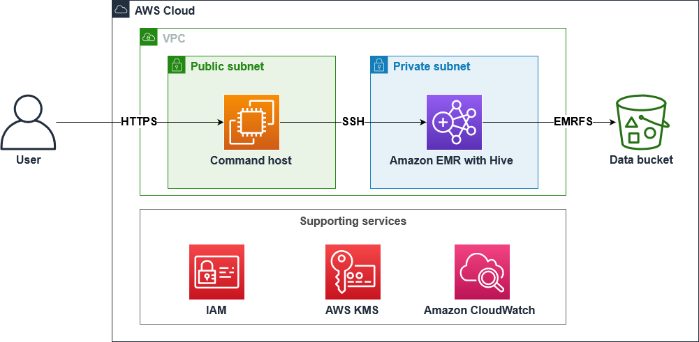

# Batch Data Processing Using Amazon EMR with Hive

The goal is to find the optimum solution that can scale up to petabytes during a poduction rollout. Amazon EMR and Apache Hive was used to meet this need.

The steps taken to achieve the goal were; to load the sample data in Amazon Simpe Storage Service (Amazon S3). Connected to the EMR cluster, created an Apache Hive table, load data from Amazon S3, and run queries using HiveQL.

