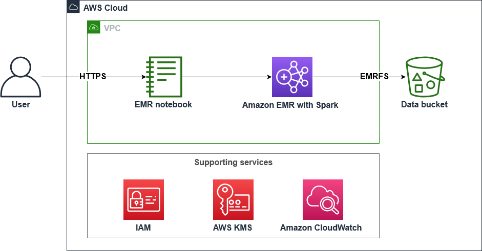

# Overview
High-Performance Batch Data Analytics Using Apache Spark on Amazon EMR

**Case Study**

# Low-Latency Data Analytics Using Apache Spark on Amazon EMR
Your company, AnyCompany Finanacials, is creating a platform for users to perform customized stock queries. You are asked to investigate low-latency data analytics for the dynamic stock application. You've decide to use Apache Spark to process the data and investigate differnt monitoring methods.

Your task is to use an EMR notebook (based on Jupyter Notebook) to create an application using PySpark, and research the operational visibility of your stock application using the Spark history server.



**Objectives**
- Review an EMR Cluster with Apache Spark
- Create an EMR notebook and connect with an EMR cluster
- Use PySpark to interact with the EMR cluster
- Access a Spark history server and review different spark job metrics


**Pre-requisites**
- EMR Cluster running Spark; Livy and JupyterEnterpriseGateway are required to connect the EMR notebook to the EMR cluster. Livy enables an interaction over a REST interface with  an EMR Cluster running spark.
- S3 data bucket:
    - Upload the Stock market data (stock_prices.csv) which contains information of the stock prices of some big technology companies.
    - Upload the notebook 
- Create a notebook on EMR on EC2 with EMRNotebookRole attached


# Get EMR cluster ID and export to the Environment.
export ID=$(aws emr list-clusters | jq '.Clusters[0].Id' | tr -d '"')

# Use the ID to get the PublicDNS name of the EMR cluster
# and export to the Environment.
export HOST=$(aws emr describe-cluster --cluster-id $ID | jq '.Cluster.MasterPublicDnsName' | tr -d '"')

# SSH to the EMR cluster
ssh -i ~/EMRKey.pem hadoop@$HOST
•	When prompted to allow a first connection to this remote server, type 
  and press ENTER.
 A message similar to the following indicates a successful connection to the leader node:
__|  __|_  )
       _|  (     /   Amazon Linux AMI
      ___|\___|___|

EEEEEEEEEEEEEEEEEEEE MMMMMMMM           MMMMMMMM RRRRRRRRRRRRRRR    
E::::::::::::::::::E M:::::::M         M:::::::M R::::::::::::::R   
EE:::::EEEEEEEEE:::E M::::::::M       M::::::::M R:::::RRRRRR:::::R
  E::::E       EEEEE M:::::::::M     M:::::::::M RR::::R      R::::R
  E::::E             M::::::M:::M   M:::M::::::M   R:::R      R::::R
  E:::::EEEEEEEEEE   M:::::M M:::M M:::M M:::::M   R:::RRRRRR:::::R
  E::::::::::::::E   M:::::M  M:::M:::M  M:::::M   R:::::::::::RR   
  E:::::EEEEEEEEEE   M:::::M   M:::::M   M:::::M   R:::RRRRRR::::R  
  E::::E             M:::::M    M:::M    M:::::M   R:::R      R::::R
  E::::E       EEEEE M:::::M     MMM     M:::::M   R:::R      R::::R
EE:::::EEEEEEEE::::E M:::::M             M:::::M   R:::R      R::::R
E::::::::::::::::::E M:::::M             M:::::M RR::::R      R::::R
EEEEEEEEEEEEEEEEEEEE MMMMMMM             MMMMMMM RRRRRRR      RRRRRR
24.	 To export the Amazon Simple Storage Service (Amazon S3) bucket name as a 
  environment variable and open the Spark shell in the EMR leader node terminal, paste the following command:
export bucket=$(aws s3api list-buckets --query "Buckets[].Name" | grep databucket | tr -d ' ' | tr -d '"' | tr -d ',')
echo $bucket
spark-shell
 A shell with 
  appears:
Welcome to
      ____              __
     / __/__  ___ _____/ /__
    _\ \/ _ \/ _ `/ __/  '_/
   /___/ .__/\_,_/_/ /_/\_\   version 3.1.1-amzn-0
      /_/

Using Scala version 2.12.10 (OpenJDK 64-Bit Server VM, Java 1.8.0_282)
Type in expressions to have them evaluated.
Type :help for more information.

scala>
25.	 To create a variable for the Amazon S3 location path, create a DataFrame, describe the schema of the loaded data, view the table content, and view the max close stock price, paste the following command:
val bucket = System.getenv("bucket")
val s3_loc = "s3://"+bucket+"/data/stock_prices.csv"

val df = spark.read.option("header","true").option("inferSchema","true").csv(s3_loc)
df.printSchema()
df.show()
df.groupBy("Ticker").agg(max("Close")).sort("Ticker").show()
 Take a look at the resulting analysis. You will see a sample table from the stock data and a table showing the maxium close price of several companies.
26.	 To exit the Spark terminal, paste the following command:
sys.exit
 Congratulations! You have successfully performed a batch analytics job.
 You can now log off the interactive demo session in the AWS Management Console, but do not end the lab. You resume the next demo from here.
________________________________________
Interactive Demo 3: Client-side encryption with EMRFS
In this demo, you create a client-side encrypted file for your batch analytics jobs using EMR File System (EMRFS) by creating, encrypting, and decrypting a file.
27.	To open the Session Manager terminal, paste the CommandHostSessionManagementUrl value from the left of these instructions to a new tab in your browser.
28.	 To connect to your EMR leader node, paste the following commands in the Session Manager terminal:
# Get EMR cluster ID and export to the Environment.
export ID=$(aws emr list-clusters | jq '.Clusters[0].Id' | tr -d '"')

# Use the ID to get the PublicDNS name of the EMR cluster
# and export to the Environment.
export HOST=$(aws emr describe-cluster --cluster-id $ID | jq '.Cluster.MasterPublicDnsName' | tr -d '"')

# SSH to the EMR cluster
ssh -i ~/EMRKey.pem hadoop@$HOST
•	When prompted to allow a first connection to this remote server, type 
  and press ENTER.
29.	 To export the Amazon S3 bucket name as a bucket environment variable, paste the following command:
export bucket=$(aws s3api list-buckets --query "Buckets[].Name" | grep databucket | tr -d ' ' | tr -d '"' | tr -d ',')
echo $bucket
Next, you will write an encrypted object to Amazon S3 from your EMR cluster.
30.	 Paste the following command to create a text file that contains the sentence: This is a practice lab!:
echo 'This is a practice lab!' > outputFile.txt
•	 Paste the following command to write this file to your Amazon S3 bucket using EMRFS:
hadoop fs -put outputFile.txt s3://${bucket}/
This command writes the file as a client-side encrypted object at rest using EMRFS to the Amazon S3 bucket that you created as part of the lab.
Now that you have encrypted an object, follow the next steps to see what the encryption did to the object in Amazon S3 and decrypt it using EMRFS.
31.	 Paste the following command to download the encrypted object directly from your Amazon S3 bucket into a encryptedOutputFile.txt file:
aws s3 cp s3://${bucket}/outputFile.txt encryptedOutputFile.txt
32.	 Paste the following command to view your encrypted object:
cat encryptedOutputFile.txt
33.	 Paste the following command to decrypt and read the object from Amazon S3 into the EMR cluster using EMRFS:
hadoop fs -cat s3://${bucket}/outputFile.txt

**By using a directed acyclic graph (DAG) spark can create efficient query plan data transformations.**

This is a basic overview to use Amazon EMR Notebook to create an application using **PySpark** and research on the operational visibility of your application using inbuilt spark history server.
   
```python
import sys
import time
from pyspark.sql import SparkSession
from pyspark.sql.functions import *
from pyspark.sql.types import *

spark =  SparkSession.builder.appName("stock-summary").getOrCreate()
dataBucket = '<dataBucket>'
 
df = spark.read.csv("s3://"+dataBucket+"/data/stock_prices.csv", header=True, inferSchema=True).select('Trade_Date', 'Ticker', 'Close', 'Volume')
df.sort(df.Trade_Date, ascending=True).show(7)

dfSql = spark.sql("SELECT Trade_Date, Ticker, round(DOUBLE(Close),2) AS Closing_Value, Volume  FROM stockprice WHERE Volume > 10000000 ORDER BY Close DESC LIMIT 10")
dfSql.sort(dfSql.Volume, ascending=False).show()
```

```python

import sys
import time
from pyspark.sql import SparkSession
from pyspark.sql.functions import *
from pyspark.sql.types import *

spark =  SparkSession.builder.appName("movie-summary").getOrCreate()

df_challenge = spark.read.csv("s3://<challengeBucket>/data/movies.csv", header=True, inferSchema=True).select('year','title','directors_0','rating','actors_0','actors_1','actors_2')

 
dfJodieFoster = df_challenge.filter( (df_challenge.actors_0 == "Jodie Foster") | (df_challenge.actors_1 == "Jodie Foster") | (df_challenge.actors_2 == "Jodie Foster") ).sort(df_challenge.year, ascending=True)

rows = dfJodieFoster.count()
dfJodieFoster.show()
print(f"Total number of movies : {rows}")
```

```python

import sys
import time
from pyspark.sql import SparkSession
from pyspark.sql.functions import *
from pyspark.sql.types import *

spark =  SparkSession.builder.appName("movies").getOrCreate()
dataBucket = '<challengeBucket>'

dfmovies = spark.read.csv("s3://"+dataBucket+"/data/movies.csv", header=True, inferSchema=True).select('year', 'title', 'rating', 'actors_0','actors_1','actors_2')
dfmovies.show(10) ##Not necessary but proves data was loaded in to the data frame
dfmovies.createOrReplaceTempView("movies_view")
dfmovies = spark.sql("SELECT year, title, rating, actors_0, actors_1, actors_2 FROM movies_view WHERE actors_0 = 'Jodie Foster' OR actors_1 = 'Jodie Foster' OR actors_2 = 'Jodie Foster' ORDER BY year ASC")
dfmovies.show()
dfmovies.count()
```


```


