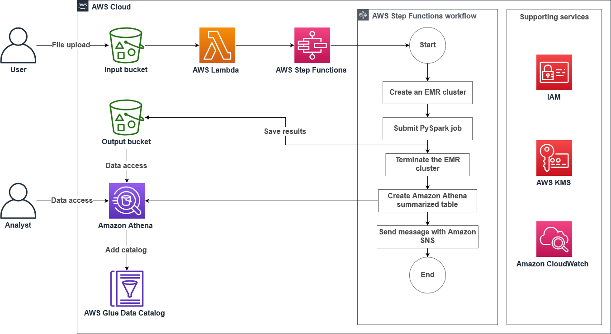

# Orchestrate Data Processing in Spark using AWS Step Functions

This goal of this implementation is to automate the batch processing job for 2020 stock data and work on reducing costs after previously building the prototype stock applictaion in an EMR notebook (based on Jupyter Notebook).

The idea is to run batch processing on 2020 stock data and append it to the 2019 stock data that has already been processed. AWS Step Functions was used to implement a solution that creates an EMR cluster when needed and terminwates the cluster when not needed, to conserve resource and reduce cost. AWS Lambda, Amazon Simple Notification Service (Amazon sns), abd stat machine were used.

 

# Objects

- Use S3 Event Notifications and AWS Lambda to automate the batch processingof data
- Use the AWS Step functions state maching language to:
    - Create an on-demand EMR cluster
    - Add an Apache Spark step job in Amazon EMR and create an Amazon Athena table to query the processed job
    - Add an Amazon SNS topic to send a notification
- Validate a Step Function state machine run
- Review an AWS Glue table and validate the processed data using Athena