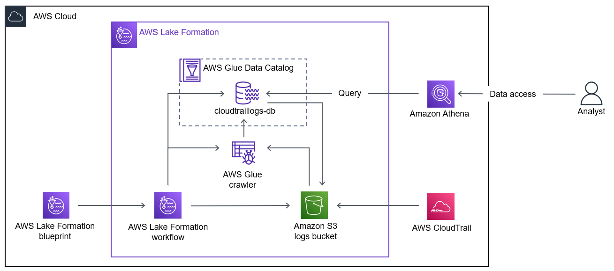

# Learn how to utilize built-in security features in AWS Lake Formation to automate the data lake setup workflow with AWS Lake Formation blueprints.

# Overview 

**case study**

You are a data engineer at a cloud marketing organization. You are asked to populate a data lake with content from AWS CloudTrail so the operational analytics team can efficiently query their data with Amazon Athena. 

use a workflow provided as an AWS Lake Formation blueprint to greatly simplify the creation of a data lake and ingestion of data. Lake Formation blueprints are workflows you can apply to an existing Lake Formation data lake. You can also apply them as a task in the setup and creation of a new data lake. 
 
**Objectives**

• Create an AWS Glue workflow using a Lake Formation blueprint. 
• Automate the Lake Formation data lake setup process with an AWS Glue workflow. 
• Create a custom AWS Glue workflow

From the architecture above, a data lake is created using a Lake Formation blueprint. The blueprint creates a workflow that uses an Amazon Simple Storage Service (Amazon S3) bucket connected to CloudTrail logs, a crawler, and a database. The workflow loads the CloudTrail log data stored in Amazon S3 into the database in the AWS Glue Data Catalog. An analyst queries the Lake Formation database with Athena. Athena uses the AWS Glue Data Catalog and reads data from the database. 

Pre-requisites:
•	Region
•	SourceDataLocation

Contents
1.	Lab overview
2.	Objectives
3.	Start lab
4.	Task 1: Explore the lab environment
5.	Task 2: Set up Lake Formation
6.	Task 3: Use a Lake Formation blueprint to create an AWS Glue workflow
7.	Task 4: Run and monitor the workflow
8.	Task 5: Validate the data lake setup results
9.	Conclusion
10.	End lab
11.	Appendix

**Challenge A:** Add more nodes to the AWS Glue workflow 

To finish your sample workflow, add the following nodes: 
• An etl trigger 
• An etl job 
• A post_etl trigger 
• A post_etl job 

Hint: Start by adding the etl trigger after the post_crawl job node. When you add a trigger, you are prompted to add a job node.  Answer: Navigate here for a solution.

**Challenge B:** Find all the errors in the CloudTrail logs 

Now that you have set up the CloudTrail data lake, AnyCompany wants you to find all the errors captured in today's logs. Run a new query to find all the logs that contain an error code. 

Hint: Find all the error messages by using WHERE NOT errorcode='' in your query.  Answer: Navigate here for a solution.  

