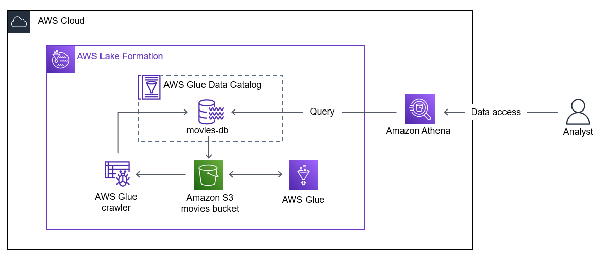

# Overview 

**Case Study**
You are a data engineer at a cloud marketing organization. You are asked to run a pilot project to build a data lake using AWS Lake Formation. 

Work through the steps to register storage with Lake Formation and define a crawler to crawl the initial dataset. Then create an AWS Glue job to generate a version of the dataset in a partitioned Apache Parquet format and use Amazon Athena to validate the tables, their schema, and the ability to access the underlying data source through the data catalog. 

**Objectives:**
• Create a data lake and a database. 
• Crawl data with AWS Glue to create a table. 
• Query data using Athena. 
• Transform data from .csv to Parquet format. 


 
In the architecture above, an Amazon Simple Storage Service (Amazon S3) bucket containing movies data is registered to Lake Formation to create a data lake. The data is loaded in AWS Glue. A crawler transforms the data from comma-separated values (.csv) to Parquet format and adds it to the database. The database is connected to the Amazon S3 bucket. An analyst is shown querying the Lake Formation database with Athena. Athena uses the AWS Glue Data Catalog and reads data from the database.

## Pre-requisites:

- Region: US East (N. Virginia)
- S3 Storage Bucket:
    - SourceDataLocation: `s3://databucket-${AWS_REGION}-${AWS_ACCOUNT_ID}/data/`
    - ParquetDataLocation: `s3://databucket-${AWS_REGION}-${AWS_ACCOUNT_ID}/data/movies_parquet/`

## STEP 1: Set up Lake Formation

For IAM role, select LakeFormationServiceRole. Note: The LakeFormationService role was created at the start of the lab and includes the s3:PutObject, s3:GetObject, s3:DeleteObject, and s3:ListBucket actions for your DataBucket.

Task 2.2: Create a database Lake Formation uses the AWS Glue Data Catalog to store metadata about data lakes, data sources, transforms, and targets. Metadata about data sources and targets is in the form of 

SELECT * FROM "data" limit 10; 43. Choose Run. In the Results section, you see 10 records from the movies table.

Challenge A: Customize your query AnyCompany wants to confirm the table contains the expected records. They know there are 1,002 movies with Action as the primary genre. Run a new query that counts the number of movies with a genres_0 of Action. Hint: Use the plus sign + to create a new query. Count all the records where genres_0='Action'.  


# Task 1: Explore the lab environment 

In this task, you review the account resources created before the lab started. 

3. At the top of the AWS Management Console, in the search bar, search for and choose S3. 
4. Choose the link for the bucket name that starts with databucket. Note: The data/ folder contains your dataset. The results/ folder stores the results of your Athena queries. You will specify the results/ folder as the query results location in Athena later in this lab. 
5. Choose the data/ folder. You will specify the data/ folder as your designated storage location for your data lake later in this lab. 
6. Choose the movies_csv/ folder. Note: There is one .csv file in the folder named movies.csv. It contains movie data from 1920-2018. The file contains data similar to the following

 
# Task 2: Set up Lake Formation 

In this task, you register your Amazon S3 data storage and create a database.

Task 2.1: Register your Amazon S3 storage 

Lake Formation manages access to designated storage locations in Amazon S3. Register the storage locations you want to be part of the data lake. 

7. At the top of the AWS Management Console, in the search bar, search for and choose AWS Lake Formation. 
8. In the Welcome to Lake Formation popup window, make sure Add myself is selected and then choose Get started. 
9. In the left navigation pane, in the Register and ingest section, choose Data lake locations. 10. Choose Register location. 
11. On the Register location page, in the Amazon S3 location section: 

• For Amazon S3 path, copy and paste the SourceDataLocation value that is listed to the left of these instructions. 
• For IAM role, select LakeFormationServiceRole. 

Note: The LakeFormationService role includes the: 

- s3:PutObject 
- s3:GetObject 
- s3:DeleteObject and 
- s3:ListBucket 

actions for your DataBucket. 

12. Choose Register location. Your Amazon S3 bucket data/ folder is now registered as the storage location for your data lake. 

Task 2.2: Create a database 

Lake Formation uses the AWS Glue Data Catalog to store metadata about data lakes, data sources, transforms, and targets. Metadata about data sources and targets is in the form of databases and tables. Tables store information about the underlying data, including schema information, partition information, and data location. Databases are collections of tables. Create a database in the AWS Glue Data Catalog. 
13. In the left navigation pane, in the Data catalog section, choose Databases. 
14. Choose Create database. 
15. On the Create database page, in the Database details section: • For name, enter movies-db. • For Location, copy and paste the SourceDataLocation value that is listed to the left of these instructions. 
16. Choose Create database. You created a database in the AWS Glue Data Catalog using Lake Formation.  

Congratulations! You successfully registered your Amazon S3 data storage and created a database. 

# Task 3: Crawl data with AWS Glue 

In this task, you use an AWS Glue crawler to create a table for your movie data in your Lake Formation database. 

Task 3.1: Create a crawler 

A crawler connects to a data store and progresses through a prioritized list of classifiers to determine the schema for your data. It then creates metadata tables in your data catalog. The crawler reads data at the source location and creates tables in the AWS Glue Data Catalog. A table is the metadata definition that represents your data, including its schema. The tables in the AWS Glue Data Catalog do not contain data. Instead, you use these tables as a source or target in an AWS Glue job definition. 

17. At the top of the AWS Management Console, in the search bar, search for and choose AWS Glue. 
18. In the left navigation pane, in the Data catalog section, choose Tables. 
19. Choose Add tables using crawler. 
20. For Name, enter movies-table. 
21. Choose Next. 
22. In the Data sources section, choose Add a data source.

23. For S3 path, copy and paste the SourceDataLocation value that is listed to the left of these instructions. Note: With the default settings, the crawler will crawl all subfolders. The crawler will find the movies.csv file in the movies_csv/ subfolder when it runs. 
24. Choose Add an S3 data source. 
25. Choose Next. 
26. For Existing IAM role, choose AdminGlueServiceRole. 
27. Choose Next. 
28. For Target database, select movies-db. 
29. Choose Next. 
30. Choose Create crawler. 

You created an AWS Glue crawler you can use to add data to your table.

Task 3.2: Run the crawler 

Run your crawler to add data to your table. 

31. Choose Run crawler. The crawling task can take a few minutes to complete. 
32. In the left navigation pane, in the Data catalog section, choose Crawlers. 
33. Choose the refresh icon to get the current crawler status. The movies-table status changes from RUNNING to STOPPING to READY. 
34. Wait until the State is READY. You have run the crawler and added data to your table. 

Task 3.3: View the table schema 

Review the AWS Glue logs and view the new table schema created by the crawler. 
35. Choose View log to review the logs in Amazon CloudWatch, including logs related to data classification and table creation.  Consider: Take a moment to view the logs. Which event confirms the partitions for the table were created? 
36. Return to the AWS Glue Console tab.
37. In the left navigation pane, in the Data catalog section, choose Tables. 
38. Choose the refresh icon to get the current list of tables. You see a data table. Note: Since there is only one folder and file in the data folder, when the crawler runs it creates a table with the root folder name.
39. On the Tables page, choose the data table to see its schema.  Consider: Do the columns listed in the Schema section match the table sample shown in Task 1? 

Task 3.4: Run a query Run a query in Athena to view a sample of the table. 

40. At the top of the AWS Management Console, in the search bar, search for and choose Athena. Note: If the Athena menu appears, choose Launch query editor. 

41. In the Workgroup primary settings window, choose Acknowledge. Note: The workgroup stores the Athena results in an Amazon S3 bucket. The primary workgroup saves the results to your data bucket in a results/ folder. In the Data section, you see the AWSDataCatalog data source and movies-db database automatically selected. In the Tables section, you see the data table listed. 
42. In the query editor, enter the following: 

41. In the Workgroup primary settings window, choose Acknowledge.
Note: The workgroup stores the Athena results in an Amazon S3 bucket. The primary workgroup saves the results to your data bucket in a results/ folder. In the Data section, you see the AWSDataCatalog data source and movies-db database automatically selected. In the Tables section, you see the data table listed. 
42. In the query editor, enter the following: SELECT * FROM "data" limit 10; 
43. Choose Run. In the Results section, you see 10 records from the movies table. 

Challenge A: Customize your query 

AnyCompany wants to confirm the table contains the expected records. They know there are 1,002 movies with Action as the primary genre. 

Run a new query that counts the number of movies with a genres_0 of Action. 

Hint: Use the plus sign + to create a new query. Count all the records where genres_0='Action'.  Answer: Navigate here for a solution.

77. Choose the plus sign + to create a new query. 
78. In the query editor, enter the following: 

```sql
SELECT COUNT(*) AS action_movies FROM "movies_csv" WHERE genres_0='Action'; 
```

79. Choose Run. In the Results section, you see `1002` returned as the count for action_movies. You successfully queried all the movies with a primary genre of Action. 


Congratulations! 

You successfully crawled data with AWS Glue, viewed logs in CloudWatch, and verified the results in Athena. 

## Task 4: Transform data using AWS Glue 

AWS Glue provides a set of built-in transforms you can use to process your data. You can call these transforms from your extract, transform, and load (ETL) script. Your data passes from transform to transform in a data structure called a DynamicFrame, which is an extension to an Apache Spark SQL DataFrame. The DynamicFrame contains your data, and you reference its schema to process your data. i Learn more: Refer to AWS Glue PySpark transforms reference in the Additional resources section for more information. 

In this task, you transform your data in .csv format to Parquet format. After completing the transformation, you run your crawlers to add the converted data to the new table. Finally, you compare the query performance using the csv file and Parquet data sources. 

Task 4.1: Create an AWS Glue job to transform data 

Create an AWS Glue job to transform the data to the Parquet format. 

44. At the top of the AWS Management Console, in the search bar, search for and choose AWS Glue. 
45. In the left navigation pane, in the Data Integration and ETL section, choose Jobs. 
46. In the Create job section, confirm Visual with a source and target is selected, and choose Create. The AWS Glue Studio visual editor opens. First, update the source bucket information using the AWS Glue Data Catalog
47. In the editor canvas, choose the Data source - S3 bucket node. 
48. In the Data source properties - S3 tab: • For S3 source type, choose Data Catalog table. • For Database, choose movies-db. • For Table, choose data. Next, update the target bucket information. 
49. In the editor canvas, choose the Data target - S3 bucket node. 
50. In the Data source properties - S3 tab: • For Format, choose Parquet. • For Compression Type, choose Uncompressed. • For S3 Target Location, copy and paste the ParquetDataLocation value that is listed to the left of these instructions. Lastly, update the AWS Glue job name, role, and script name. 
51. In the node toolbar, choose Job details. 
52. In the Basic properties section: • For Name, enter ParquetConversion. • For IAM Role, choose AdminGlueServiceRole. 
53. Choose Save. 
54. Choose Run. 
55. Choose the Runs tab to monitor the AWS Glue job status.
56. Choose the refresh icon to get the current AWS Glue job status. 

Note: There are currently 10 workers using the worker type G.1X. For a simple conversion AWS Glue job, 10 workers are more than enough. When setting up an AWS Glue job, you can customize the number of workers and the worker type to fit your use case. The AWS Glue job run status changes from Running to Succeeded. 

57. Wait until the Run status is Succeeded. You created an AWS Glue job to transform data. 

Task 4.2: Run crawlers to add Parquet data in your table 

In this task you run your existing crawler to add the table for the newly transformed data. 
58. At the top of the AWS Management Console, in the search bar, search for and choose AWS Glue. 
59. In the left navigation pane, in the Data Catalog section, choose Crawlers. 
60. Select the movies-table crawler link, and then choose Run crawler. 
61. In the left navigation pane, in the Data catalog section, choose Crawlers. 
62. Choose the refresh icon to get the current crawler status. 

The movies-table status changes from RUNNING to STOPPING to READY. 

63. Wait until the State is READY. 
64. At the top of the AWS Management Console, in the search bar, search for and choose AWS Lake Formation.
65. In the left navigation pane, in the Data catalog section, choose Tables. 

You see three tables: 
• movies_parquet 
• movies_csv 
• data 

66. On the Tables page, choose the movies_parquet table to see its details.  

Consider: There is a significant time and size complexity difference between querying the data using a .csv file as a datasource and using the columnar storage format of Parquet.

Task 4.3: Compare Athena query performance for each data source 

In this task you run queries using the csv file and Parquet format to comare the query performance results.

67. At the top of the AWS Management Console, in the search bar, search for and choose Athena. In the Data section, you see the AWSDataCatalog data source and movies-db database automatically selected. In the Tables section, you see the data table listed. 
68. Choose the plus sign + to create a new query using the csv file data source. 
69. In the query editor, enter the following: 

```sql 
SELECT Count(*) AS action_movies FROM "movies_csv" where genres_0='Action';
``` 

70. Choose Run. In the Query Results tab, note the Time in queue, Run time and Data scanned values. 
Also note there are 1002 results. 

71. Choose the plus sign + to create a new query. This time, use the Parquet data source. 
72. In the query editor, enter the following: 

```sql
SELECT Count(*) AS action_movies FROM "movies_parquet" where genres_0='Action';
```

73. Choose Run. 

In the Query Results tab, note the Time in queue, Run time, and Data scanned values and compare to the previous query values. While the Time in queue and Run time are comparable, the Data scanned size is significantly smaller for the Parquet data source due to the columnar format of the data structure, despite the same results count.  

**Consider:** It is important to consider the impact data size has on query performance and time complexity. What would happen if you queried a million movies?  


## Summary 
In this project, I successfully transformed the movie data from .csv to Parquet format, run crawlers to add the converted Parquet data to a new table, and compared the Athena queries using csv file and Parquet data sources. The following objectives were implemented:
• Created a data lake and a database. 
• Crawled data with AWS Glue to create a table. 
• Queried data using Athena. 
• Transformed data from .csv to Parquet format.

## Additional resources 
• AWS Glue PySpark transforms reference Appendix Challenge A solution Query your table for all the movies with a primary genre of Action. 


