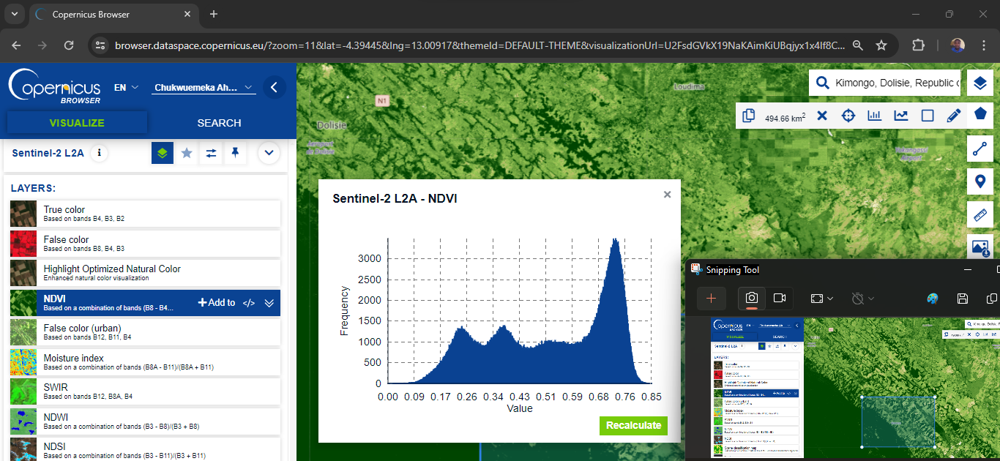
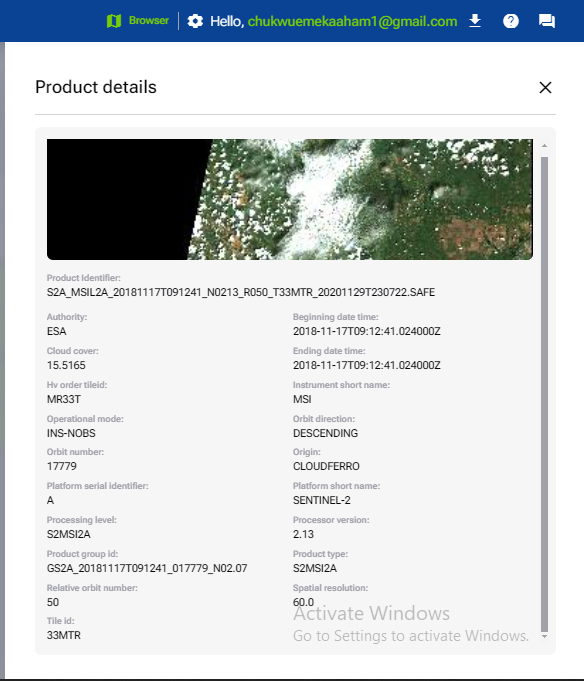

# ETL Workflow for Deforestation Monitoring in the Congo Basin.

## Project Overview
This project demonstrates an ETL workflow for ingesting and processing geospatial data, specifically focusing on monitoring deforestation in the Congo Basin using Sentinel-2 satellite imagery.

## Impactful Problem:
Deforestation in the Congo Basin is a significant issue, contributing to climate change, biodiversity loss, and impacting livelihoods. Accurate and timely analysis of forest cover change is crucial for monitoring deforestation trends, supporting conservation efforts, and informing policy decisions in this critical rainforest region.

### Maiombe, Republic of the Congo


- Key Deforestation Drivers: This area is facing high deforestation rates driven by:
    - Logging: Industrial logging is a major pressure, with some areas having been significantly depleted.
    - Agriculture: The expansion of agricultural land, particularly for palm oil plantations, is also a concern.
- Additional Factors: The Mayombe Forest is also vulnerable to:
    - Mining: Mining operations, particularly for iron ore, can cause habitat loss and fragmentation.
    - Poaching: The region is home to a rich diversity of wildlife, and poaching is a threat to endangered species.

#### Choosing a Region:
The following where considered when making a choice:
- Data Availability: Checked if there is sufficient Sentinel-2 data for the chosen area on the Copernicus Data Space platform.
- Research Focus: Matched the area to the specific challenge related to deforestation in the Congo Basin.
- Availability of Supporting Data: Additional data sets (e.g., land use maps, forest inventory data) that might be relevant for the analysis.

#### Narrowing the Area down to Kimongo



Kimongo is a town located in the Maiombe region of the Republic of the Congo. It is situated in the southwestern part of the country, within the Kouilou Department. Maiombe is known for its lush rainforest and diverse ecosystems, and Kimongo serves as a local center for the surrounding areas.  Efforts are being made to monitor and combat deforestation through sustainable practices and conservation initiatives, but challenges remain.

## Research Question:
How has deforestation progressed in the Kimongo Area of Maiombe, Congo Basin between 2018-07-30 and 2024-08-02?

## Project Goals:

* Ingest and process Sentinel-2 satellite imagery to map forest cover change over time in the Kimongo Area.
* Use STAC (SpatioTemporal Asset Catalog) metadata for efficient data discovery and access.
* Leverage the open-source geospatial ecosystem (rasterio/GDAL, Shapely, GeoPandas, xarray/rioxarray, Zarr, Dask) for geospatial data processing.
* Output a map product visualizing forest cover change in Kimongo Area for the specified time period.

## Data Sources:

- Data Space website to download Sentinel-2 data covering the Kimongo Area from July 2023 - August 2024.

* **Sentinel-2:** Download Sentinel-2 data from the Copernicus Open Access Hub: The Copernicus Open Access Hub has moved to https://dataspace.copernicus.eu/.

* **STAC Catalog:** Explore the STAC catalog for Sentinel-2 data using tools like [https://stac-browser.com/](https://stac-browser.com/), https://github.com/radiantearth/stac-spec or [https://explorer.earthdata.nasa.gov/](https://explorer.earthdata.nasa.gov/)

## Using the STAC catalog:
To download Sentinel-2 data from the new Data Space website, follow these steps:
- Visit the Data Space Website: https://dataspace.copernicus.eu/
- Search for Sentinel-2 Data: Use the search bar to find Sentinel-2 data for your desired area and time period. You can specify:
    - Area of Interest: Use the map or coordinates to define your region.
    - Date Range: Set your start and end dates.
    - Other Filters: You can filter by sensor, cloud cover, and other parameters.
    - Select Data Products: View the available data products and choose the ones that meet your requirements.
    - Download the Data: Click on the download button to access the data in the desired format (GeoTIFF, JP2, COG, or others).

- STAC Specification: Follow the STAC specification for creating a valid STAC Catalog JSON file. https://github.com/radiantearth/stac-spec

- A STAC Catalog JSON file was generated for the Map Products using `Pystac` a python library for generating and managing STAC Catalogs. 

# CURRENT RASTER DATASET PRODUCT INFO

[Stac_Catalog](./stac_catalog/current_catalog-20240910_145458/)

**AREA - 494.66 km2**

{"type":"Polygon","coordinates":[[[12.834091,-4.56342],[12.834091,-4.39776],[13.07579,-4.39776],[13.07579,-4.56342],[12.834091,-4.56342]]]}

## ATTRIBUTES

### Summary
- Name:
S2A_MSIL2A_20240728T090601_N0511_R050_T33MTR_20240728T165450.SAFE
- Size:
804MB
- Sensing time:
2024-07-28T09:06:01.024000Z
- Platform short name:
SENTINEL-2
- Instrument short name:
MSI

#### Product
- Absolute orbit number:
47523
- Acquisition mode:
INS-NOBS
- Beginning date time:
2024-07-28T09:06:01.024000Z
- Cloud cover:
22.568591
- datastripId:
S2A_OPER_MSI_L2A_DS_2APS_20240728T165450_S20240728T092442_N05.11
- Ending date time:
2024-07-28T09:06:01.024000Z
- granuleIdentifier:
S2A_OPER_MSI_L2A_TL_2APS_20240728T165450_A047523_T33MTR_N05.11
- Modification date:
2024-07-28T18:01:44.217010Z
- Origin date:
2024-07-28T17:51:23.000000Z
- Processed by:
ESA
- Processing date:
2024-07-28T16:54:50.000000+00:00
- Processing level:
S2MSI2A
- Processor version:
05.11
- Product group id:
GS2A_20240728T090601_047523_N05.11
- Product type:
S2MSI2A
- Publication date:
2024-07-28T18:00:29.172768Z
- Relative orbit number:
50
- S3Path:
/eodata/Sentinel-2/MSI/L2A/2024/07/28/S2A_MSIL2A_20240728T090601_N0511_R050_T33MTR_20240728T165450.SAFE
- sourceProduct:
S2A_OPER_MSI_L2A_TL_2APS_20240728T165450_A047523_T33MTR_N05.11,S2A_OPER_MSI_L2A_DS_2APS_20240728T165450_S20240728T092442_N05.11
- sourceProductOriginDate:
2024-07-28T17:51:23Z,2024-07-28T17:50:29Z
- Tile id:
33MTR


#### Instrument
- Instrument short name:
MSI

#### Platform
- Platform short name:
SENTINEL-2
- Satellite platform:
A

#### Download single files
- S2A_MSIL2A_20240728T090601_N0511_R050_T33MTR_20240728T165450.SAFE
- DATASTRIP
- GRANULE
- HTML
- rep_info
- INSPIRE.xml
- manifest.safe
- MTD_MSIL2A.xml
- S2A_MSIL2A_20240728T090601_N0511_R050_T33MTR_20240728T165450-ql.jpg

- Product id:
https://zipper.dataspace.copernicus.eu/odata/v1/Products(749637bc-7caa-4e2c-bdfe-70864e3792ec)/$value

    https://link.dataspace.copernicus.eu/m72t

## Key Considerations:
- Cloud Coverage: Cloud cover can significantly impact the accuracy of forest cover change analysis. Aim for a maximum cloud coverage threshold of 20-30% for your Sentinel-2 data. This threshold can be adjusted based on specific region, time of year, and desired accuracy may be necessary.
- Mosaicking Order: For deforestation analysis, prioritizing temporal consistency when mosaicking images is important. Images should be mosaic in chronological order (oldest to newest) to track forest cover change over time. Time gaps between mosaicked images should be minimized for a more accurate representation.

## Project Structure:

```Folder PATH listing
Volume serial number is B091-13FC
C:.
│   Baseline.ipynb
│   Change.ipynb
│   current ndvi map.png
│   Current_ETL.ipynb
│   docker-compose.yaml
│   INSPIRE.xml
│   manifest.safe
│   MTD_MSIL2A.xml
│   NDVI Diff Map.png
│   README.md
│   requirements.txt
│   
├───Browser_images
│   └───SENTINEL-2
│       │   2023-07-01-00_00_2024-08-02-23_59_Sentinel-2_L2A_B04_(Raw).tiff
│       │   2023-07-01-00_00_2024-08-02-23_59_Sentinel-2_L2A_B08_(Raw).tiff
│       │   2023-07-01-00_00_2024-08-02-23_59_Sentinel-2_L2A_NDVI.tiff
│       │   S2A_MSIL2A_20181117T091241_N0213_R050_T33MTR_20201129T230722-ql.jpg
│       │
│       └───Baseline
│               2018-07-31-00_00_2023-07-30-23_59_Sentinel-2_L2A_B04_(Raw).tiff
│               2018-07-31-00_00_2023-07-30-23_59_Sentinel-2_L2A_B08_(Raw).tiff
│               2018-07-31-00_00_2023-07-30-23_59_Sentinel-2_L2A_NDVI.tiff
│
├───img
│       01.png
│       02.png
│       03.png
│       04.png
│       05.png
│       06.png
│       07.png
│       08.png
│       09.png
│       10.png
│       11.png
│       12.png
│       base-1.png
│       base-2.png
│       base-3.png
│       base-4.png
│
├───kimongo_ndvi_archive
│   └───kimongo.zarr
│       │   .zgroup
│       │   .zmetadata
│       │
│       ├───kimongo-etl-job
│       │   │   .zattrs
│       │   │   .zgroup
│       │   │   
│       │   ├───band
│       │   │       .zarray
│       │   │       .zattrs
│       │   │       0
│       │   │
│       │   ├───spatial_ref
│       │   │       .zarray
│       │   │       .zattrs
│       │   │       0
│       │   │
│       │   ├───x
│       │   │       .zarray
│       │   │       .zattrs
│       │   │       0
│       │   │
│       │   ├───y
│       │   │       .zarray
│       │   │       .zattrs
│       │   │       0
│       │   │
│       │   └───__xarray_dataarray_variable__
│       │           .zarray
│       │           .zattrs
│       │           0.0.0
│       │           1.0.0
│       │
│       ├───kimongo-etl-job-baseline
│       │   │   .zattrs
│       │   │   .zgroup
│       │   │
│       │   ├───band
│       │   │       .zarray
│       │   │       .zattrs
│       │   │       0
│       │   │
│       │   ├───spatial_ref
│       │   │       .zarray
│       │   │       .zattrs
│       │   │       0
│       │   │
│       │   ├───x
│       │   │       .zarray
│       │   │       .zattrs
│       │   │       0
│       │   │
│       │   ├───y
│       │   │       .zarray
│       │   │       .zattrs
│       │   │       0
│       │   │
│       │   └───__xarray_dataarray_variable__
│       │           .zarray
│       │           .zattrs
│       │           0.0.0
│       │           1.0.0
│       │
│       └───kimongo-etl-job-difference
│           │   .zattrs
│           │   .zgroup
│           │
│           ├───band
│           │       .zarray
│           │       .zattrs
│           │       0
│           │
│           ├───spatial_ref
│           │       .zarray
│           │       .zattrs
│           │       0
│           │
│           ├───x
│           │       .zarray
│           │       .zattrs
│           │       0
│           │
│           ├───y
│           │       .zarray
│           │       .zattrs
│           │       0
│           │
│           └───__xarray_dataarray_variable__
│                   .zarray
│                   .zattrs
│                   0.0.0
│                   1.0.0
│
├───log
│       ndvi_log.txt
│
└───stac_catalog
    ├───baseline_catalog-20240910_154345
    │   │   catalog.json
    │   │
    │   └───S2A_MSIL2A_20181117T091241_N0213_R050_T33MTR_20201129T230722.SAFE
    └───current_catalog-20240910_145458
        │   catalog.json
        │
        └───S2A_MSIL2A_20240728T090601_N0511_R050_T33MTR_20240728T165450.SAFE -- renamed, too long for github.
        
```

* **ETL_Workflow.ipynb:** Jupyter Notebook containing the ETL pipeline code.

##  Runing the Project

1. Install Required Packages:

```bash
pip install -r requirements.txt
```
2. Dask Scheduler

```bash
dask-scheduler

dask-worker tcp://127.0.0.1:8786 --nworkers 4
```

4. Run the Jupyter Notebook:
`jupyter notebook .ipynb `

- [Current_ETL.ipynb](Current_ETL.ipynb)
- [Baseline.ipynb](Baseline.ipynb)
- [Change.ipynb](Change.ipynb)


# NDVI (Normalized Difference Vegetation Index) and Deforestation:


- NDVI: NDVI is a widely used index in remote sensing. It measures the "greenness" of vegetation by comparing the reflectance of near-infrared (NIR) light and red light. Higher NDVI values indicate denser and healthier vegetation.

Deforestation is the clearing of forests, usually for agriculture, logging, or development. It leads to a decrease in vegetation and thus a decrease in NDVI values.


## Initial Result


- Green Areas: Areas with dark green colors on the map likely represent areas with dense and healthy vegetation.

- Yellow Areas: Areas with yellowish hue indicate less dense vegetation or areas where some deforestation might have occurred.

- Red Areas: Areas with reddish colors are likely areas with very low NDVI, which could represent significant deforestation or areas of bare soil.

### Deduction

The map provides a visual representation of possible deforestation in the Kimongo Area of Maiombe, Congo Basin. It suggests that while there is still a significant amount of forest cover, some deforestation has occurred.


# Next step in my analysis:

Additional data is needed to provide more information for complete analysis:

- **Baseline NDVI**: Comparing the NDVI values to a baseline map from before the deforestation period to quantify the extent of change.

- **Land Use Data**: Overlaying the NDVI map with land use data (e.g., agriculture, mining, urban areas) to understand the causes of deforestation.


# PART 2

####  Baseline Product



[Stac_Catalog](./stac_catalog/baseline_catalog-20240910_154345/)

# NDVI Difference Results


This part of the analysis, compares NDVI maps from 2018 (baseline) and 2024 (current).

**Current NDVI:**

- **Dark Green:** Dense and healthy vegetation in 2024.
- **Yellow/Orange:** Less dense vegetation, potentially due to deforestation, degraded vegetation, or seasonal changes.

**Baseline NDVI:**

- **Dark Green:** Dense forest cover in 2018.

**NDVI Difference (2024 - 2018):**

- **Red:**  Significant decrease in NDVI, likely representing deforestation (e.g., logging, agriculture, mining).
- **Orange:**  Smaller decrease in NDVI, potentially indicating less severe deforestation or vegetation degradation.
- **Green:**  Increase in NDVI, suggesting potential forest regrowth or areas that were already less dense and have recovered.

## Deductions

- **Deforestation is evident:** The red and orange areas on the NDVI difference map highlight areas where deforestation has likely occurred. 
- **Deforestation Patterns:** Deforestation appears concentrated in specific areas, possibly along river valleys, roads, or zones of high human activity.
- **Potential for Regrowth:** The presence of green areas in the difference map indicates that some regions might be experiencing regrowth or were already less densely forested.

## Conclusion

The NDVI analysis provides a clear visual depiction of potential deforestation in the Kimongo area of the Maiombe Congo Basin, highlighting areas of vegetation loss and potential regrowth. Additionally, ground-truthing data from fieldwork can help verify the accuracy of the NDVI results.