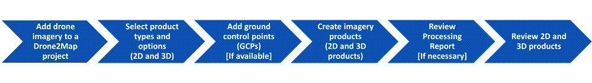
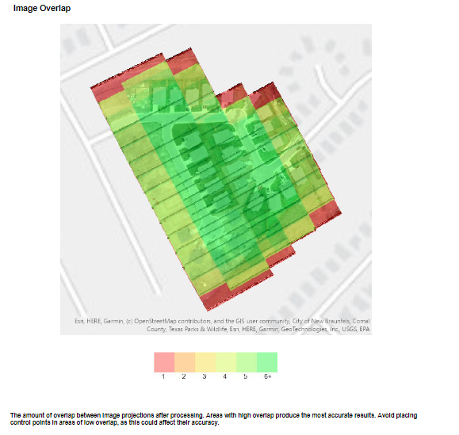

## Processing Drone Data with ArcGIS Drone2Map to Model a Construction Project

This project utilizes ArcGIS Drone2Map to process drone data of a residential development, generating 2D and 3D imagery products for project visualization and analysis. The goal is to create high-quality imagery that can be used to communicate project progress to stakeholders. 

**Scenario:**

As a GIS analyst working for a company developing a new residential neighborhood, I recently acquired drone imagery of the construction site, and my task is to create imagery products to show project progress to city officials and the design and construction teams.

**1. Workflow:**

The processing was structured in eleven steps:
1. Configuring of processing settings
2. Adding ground control points (GCPs), 
3. Interpreting the generated imagery products.

## Project and Data Directory

After setting up `Drone2Map`, a new project named `SubdivisionProgress` was created using the `Rapid Template`, to quickly verify that importing the drone collection was successful. The drone imagery folder was added from the `SubdivisionDroneData`. 

- Project name **"SubdivisionProgress"** - [Project](./Projects/)
- Drone imagery and ground control points - [SubdivisionDroneData](./Data/)

The `orange line` represents the `flight line`, or `flight track`, of the drone during collection, while the `blue dots` are the enabled `images` in the project.

## Configuring Processing Options

`Study requirements:`

2D Imagery Products
* True Ortho | An orthorectified image corrected using a digital surface model, which removes perspective distortion.
There is no displacement caused by relief, vegetation, or non-natural structures
* Digital elevation models (DEMs)
    - digital surface model (DSM) | Representation of elevation values over a surface, including features such as vegetation and non-natural structures.
    - digital terrain model (DTM) | Representation of elevation values over a surface, often referred to as bare earth, it does not include features such as vegetation and non-natural structures.

3D Imagery Products

* 3D point cloud | A large collection of high density x,y,z points represented in 3D space.
* DSM meshes | 2.5D textured model in which the adjusted images are draped on a triangular irregular network (TIN) version of the
DSM.
* 3D Mesh | 3D textured model in which the ground and above-ground features such as vegetation and non-natural structures, are densely and accurately reconstructed. A 3D mesh can be viewed from any angle to get a realistic and accurate
depiction of a project area.

Configured the processing options by checking the necessary boxes for both `2D and 3D` products, adjusting general settings as needed. Added `Ground Control Points (GCPs)` to the project, ensuring each GCP has the appropriate image links associated with it. Ground control points (GCPs) are marked points on the ground used in aerial photography to identify known coordinate locations.
GCPs are used during processing to improve the accuracy of the drone data, which in turn improves the
quality of the imagery products.

The three ground control points are represented by green plus symbols

## Processing Imagery Products

Finally, started the `processing` of the `imagery products` and reviewed the generated outputs. 

The `2D` imagery was examined, including the `True Ortho layer`. The `Elevation profiles` were analyzed to assess changes in terrain. I explored the `Digital Surface Model (DSM)` and `Digital Terrain Model (DTM)` layers, and visualized the results in a `3D scene`. Additionally, the `3D products` were also explored in `Scene Viewer` to gain more insights and communicate the findings.

2. Reviewing the generated outputs:

**Processing Report:**

* [Processing Report.pdf](./Processing%20Report.pdf)

The Processing Report includes information about the process and the resulting products. Ground Resolution represents the ground sampling distance (GSD) of the original sensor.

* **The ground resolution is 0.016 (m).**
* **There were 40 images that were calibrated, which are all the images in the folder**

* The cell size is `0.06 meters` because the automatic resolution was set at 4 x GSD, when configuring the processing options for the 2D products, which is reflected in the cell size, or spatial resolution, of the new orthomosaic.

`Image Overlap`

- Areas in green indicate more coverage. Due to the number of overlapping images in the green areas, the quality of the product is greater in those areas.

- 2D imagery, including the **True Ortho** layer.
The reported scale is approximately 1:240. At this scale, we can clearly see many features. This true ortho will enable the project team to visually inspect the subdivision construction
site.

- Analyzing the elevation profiles to assess changes in terrain.

- **Digital Surface Model (DSM)** 

- **Digital Terrain Model (DTM)** 

- Visualized the results in a 3D scene.

## Exploring the 3D Products in Scene Viewer

* **`Subdivision Progress 3D Mesh` scene layer in Scene Viewer**
    * Average height of the tallest home in the scene?
    * House with the largest fenced-in yard?
    * When the shadows are enabled, houses that has shaded backyards on August 25, 2023, at 4:00 PM, Central Time (UTC-6 CST - US and Canada)?
    

    * House driveway with the most area, and the measurement?
    

