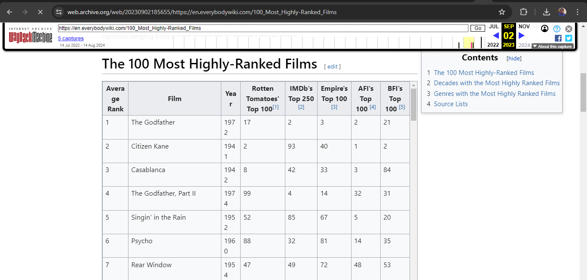

# Web scraping and Extracting Data using APIs

Web scraping is used for extraction of relevant data from web pages. If you require some data from a web page in a public domain, web scraping makes the process of data extraction quite convenient. The use of web scraping, however, requires some basic knowledge of the structure of HTML pages. In this lab, you will learn the process of analyzing the HTML code of a web page and how to extract the required information from it using web scraping in Python.

## Objectives

Use the requests and BeautifulSoup libraries to extract the contents of a web page

Analyze the HTML code of a webpage to find the relevant information

Extract the relevant information and save it in the required form

## Scenario

Consider that you have been hired by a Multiplex management organization to extract the information of the top 50 movies with the best average rating from the web link shared below.

https://web.archive.org/web/20230902185655/https://en.everybodywiki.com/100_Most_Highly-Ranked_Films

**The information required is Average Rank, Film, and Year.**

You are required to write a Python script webscraping_movies.py that extracts the information and saves it to a CSV file top_50_films.csv. You are also required to save the same information to a database Movies.db under the table name Top_50.

## Analyzing the HTML code for relevant information
Open the web page in a browser and locate the required table by scrolling down to it. Right-click the table and click Inspect at the bottom of the menu, as shown in the image below.

Notice that all rows under this table are mentioned as tr objects under the table. Clicking one of them would show that the data in each row is further saved as a td object, as seen in the image above. You require the information under the first three headers of this stored data.

It is also important to note that this is the first table on the page. You must identify the required table when extracting information.