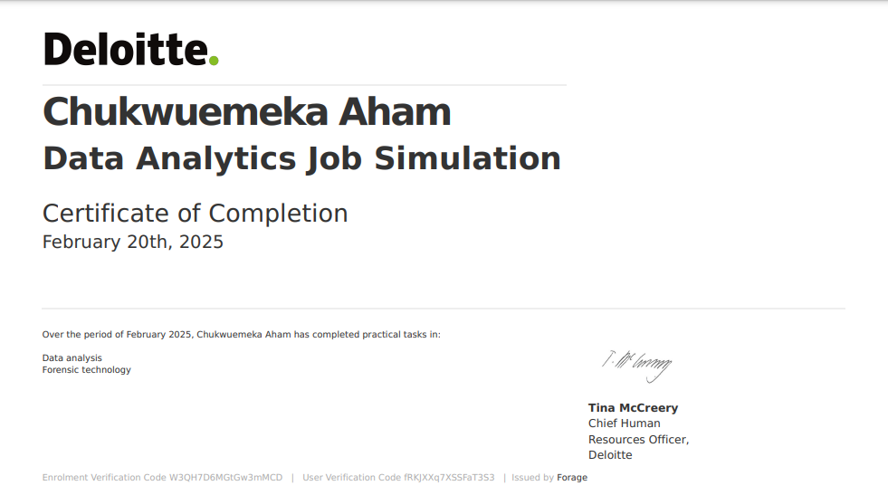

# **I just completed Deloitte Australia's Data Analytics on Forage. In the simulation I:**

- Completed a Deloitte job simulation involving data analysis and forensic technology 
- Created a data dashboard using Tableau 
- Used Excel to classify data and draw business conclusions

**Check out the simulation here:** https://www.theforage.com/simulations/deloitte-au/data-analytics-s5zy

**Download** the [daikibo-telemetry-data.json.zip](https://www.theforage.com/simulations/deloitte-au/data-analytics-s5zy) file -> unzip -> and import it in Tableau.

**Dashboard:** https://public.tableau.com/app/profile/chukwuemeka.aham/viz/DeliotteInternship-1/Dashboard1?publish=yes

## Certificate

